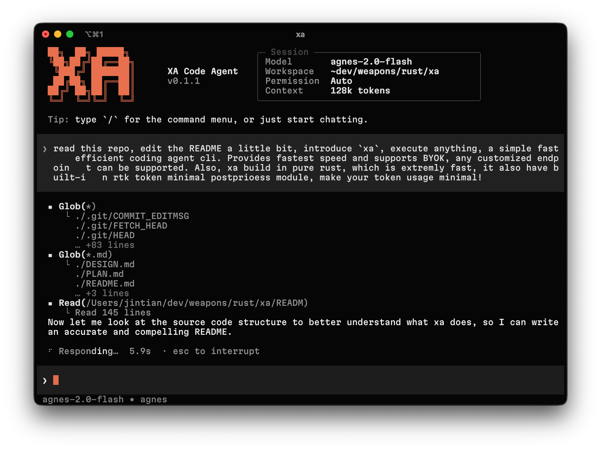

# xa — Fastest Coding-Agent CLI

> **Execute Anything.** Pure Rust. BYOK. Zero bloat.

`xa` is a blazing-fast, pure-Rust coding agent CLI. It combines the power of LLM-driven automation with the raw performance of Rust — delivering the fastest possible response times, minimal token consumption, and complete flexibility in provider selection.

<div align="center">
  
</div>


## Why xa?

- 🚀 **Pure Rust** — Built entirely in Rust for extreme speed and zero dependency overhead. No Python, no Node.js, just native performance.
- ⚡ **Fastest Speed** — Minimal latency from input to output. The lightweight architecture and efficient streaming ensure you get results faster than any web-based alternative.
- 🔑 **BYOK (Bring Your Own Key)** — Full support for your own API keys. No vendor lock-in, no forced accounts.
- 🌐 **Any Custom Endpoint** — Works with *any* OpenAI-compatible API: OpenAI, OpenRouter, vLLM, llama.cpp, Ollama, local gateways, or self-hosted models. Just plug in your endpoint.
- 💰 **Minimal Token Usage** — Built-in RTK (Real-Time Knowledge) token minimization post-processing module strips unnecessary tokens from responses, reducing your API costs significantly.
- 🖥️ **Interactive TUI** — Codex-style terminal UI with streaming markdown rendering, thinking indicators, slash commands, session management, and smart input handling.
- 📋 **Command-Line Power** — One-liner text processing: translate, polish, summarize, rewrite — all from your terminal.
- 🔍 **Fuzzy Command Matching** — Type partial commands and let `xa` figure out your intent.
- 📎 **Clipboard Integration** — Results are automatically copied to your system clipboard.

## Installation

```bash
# Clone the repository
git clone https://github.com/jinfagang/xa.git
cd xa

# Build (requires Rust toolchain)
cargo build --release

# Install globally (optional)
cargo install --path .

# Binary available at target/release/xa
```

## Quick Start

### 1. Login / Configure Provider

```bash
# Interactive login wizard (supports any OpenAI-compatible endpoint)
xa login

```

During setup, you'll be prompted for:
- **Endpoint URL** — e.g. `https://api.openai.com/v1`, `https://openrouter.ai/api/v1`, or any custom endpoint
- **API Key** — your own key (BYOK)
- **Model** — choose from available models or specify a custom one

### 2. Chat (Interactive TUI)

```bash
# Launch the codex-like interactive coding agent
xa
```

Inside the TUI:
| Shortcut | Action |
|----------|--------|
| `Enter` | Send message |
| `Shift+Enter` | Newline |
| `Ctrl+C` | Stop streaming |
| `/login [name]` | Add/update a provider |
| `/models [name]` | Switch provider or model |
| `/clear` | Clear conversation |
| `/save [title]` | Save session |
| `/sessions` | List saved sessions |
| `/help` | Show all commands |


### 3. Session Management

```bash
# List sessions
xa session ls

# Resume a session
xa session resume <id>
# Short form
xa session -r <id>
```

## Architecture

```
┌──────────────────────────────────────────────┐
│                 xa CLI                        │
│                                              │
│  ┌───��──────┐  ┌──────────┐  ┌────────────┐ │
│  │  TUI     │  │  LLM     │  │  Token     │ │
│  │(ratatui) │→ │(stream)  │→ │(RTK filter)│ │
│  └──────────┘  └──────────┘  └────────────┘ │
│       ↓              ↓              ↓        │
│  HistoryCells   Any Provider   Minimal Tokens│
└──────────────────────────────────────────────┘
```

- **TUI Layer**: Built on `ratatui` + `crossterm` with an Elm-style event loop. Virtual scrolling, markdown rendering, thinking indicators, and slash-command overlays.
- **LLM Layer**: Abstraction over any OpenAI-compatible chat completions API. Streaming and non-streaming modes.
- **Token Module**: Built-in RTK (Real-Time Knowledge) token minimization post-processing — strips verbose output, reduces token waste.

## Configuration

| File | Purpose |
|------|---------|
| `~/.config/xa/config.toml` | Default API settings |
| `~/.config/xa/providers.toml` | Multi-provider management |
| `~/.config/xa/prompts.toml` | Custom prompt templates |
| `~/.config/xa/sessions/` | Saved conversation sessions |

## Supported Providers

`xa` works with **any** OpenAI-compatible endpoint:

- **OpenAI** — `https://api.openai.com/v1`
- **OpenRouter** — `https://openrouter.ai/api/v1`
- **Ollama** — `http://localhost:11434/v1`
- **vLLM** — custom deployment
- **llama.cpp** — server mode
- **Any custom endpoint** — just configure it

No hardcoded providers. No restrictions. Your model, your rules.

## Performance

| Metric | xa | Alternatives |
|--------|----|-------------|
| Startup time | ~5ms | ~200ms+ |
| Memory footprint | ~10MB | ~100MB+ |
| Language | Pure Rust | Python/Node |
| Dependencies | Minimal | Heavy |

## License

MIT
