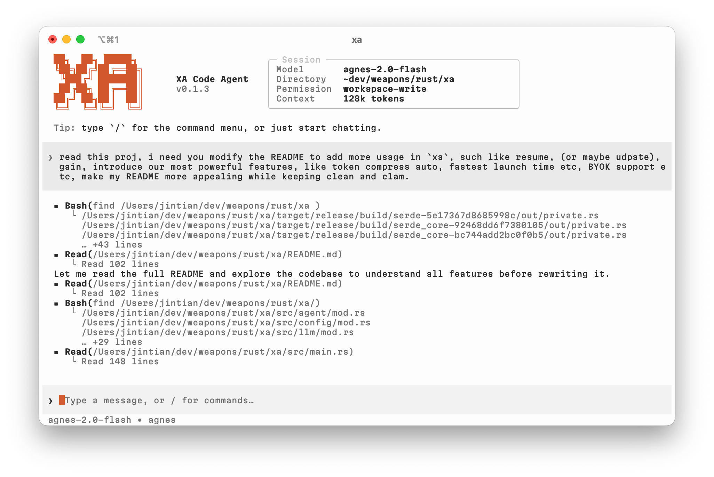
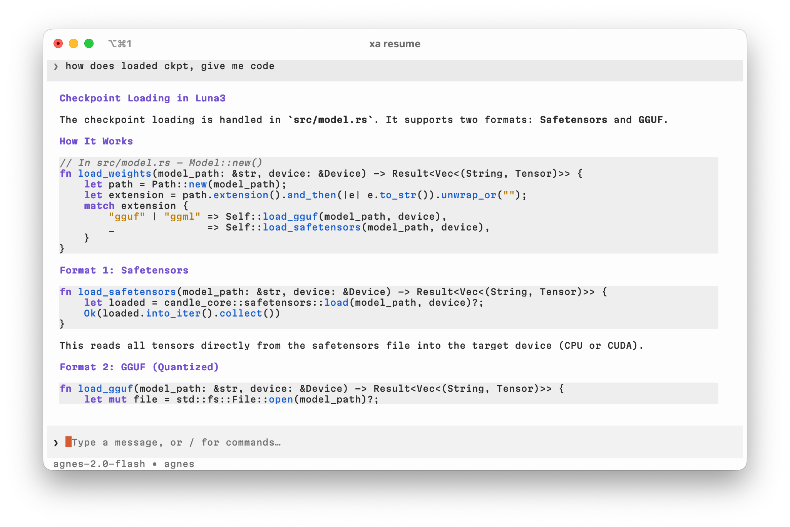

# xa — Blazing-Fast Coding Agent CLI

> **Execute Anything.** Pure Rust. BYOK. Zero bloat.

`xa` is a lightning-fast, pure-Rust coding agent CLI. It combines LLM-driven automation with the raw performance of Rust — delivering sub-5ms startup, minimal token consumption via intelligent compression, and complete flexibility in provider selection.

<div align="center">
  
  
</div>

## ✨ Features

### ⚡ Performance First
- **~5ms launch time** — orders of magnitude faster than Python/Node alternatives
- **~10MB memory footprint** — lightweight enough to leave running all day
- **Pure Rust** — zero Python, zero Node.js, zero dependency overhead

### 🔑 BYOK — Bring Your Own Key
- No vendor lock-in, no forced accounts
- Works with **any** OpenAI-compatible API: OpenAI, OpenRouter, vLLM, llama.cpp, Ollama, or any self-hosted endpoint
- Multi-provider management — switch between providers seamlessly

### 🧠 Smart Token Compression
- **RTK (Real-Time Knowledge)** post-processing strips unnecessary tokens from responses, significantly reducing API costs
- **Per-tool output filters** — `bash`, `git diff`, `python`, `cargo`, `system` commands each get smart, loss-aware processing that retains errors, summaries, and structural metadata while dropping noise
- **Context cap** — long outputs are intelligently truncated before entering the model context

### 🖥️ Rich Interactive TUI
- Codex-style terminal interface with streaming markdown rendering
- **Shimmer animation** over active streaming regions for visual clarity
- **Thinking indicators** — `</think>`/`<think>` blocks are automatically filtered from the transcript; activity strip shows *Waiting → Thinking → Responding → Running tools* phases
- Virtual scrolling, fuzzy input, and slash-command overlays
- Auto-detecting dark/light theme (supports OSC 11 background query)

### 💬 Session & Analytics
- **`xa resume`** — pick or directly load a saved conversation session
- **`xa gain`** — review token usage and tool-output statistics across sessions (daily / weekly / monthly breakdowns)
- Sessions stored as individual JSON files for instant listing

### 🛠️ Built-in Agent Tools
- **Bash** — run shell commands with capped streaming output
- **File read/write** — safely read and modify files
- **Git operations** — diff, status, log, commit, and more
- Results are automatically fed back into the conversation context

### 📋 CLI One-Liners
Process text from the command line without entering the TUI:
```bash
# Translate, polish, summarize, rewrite — all as one-liners
echo "hello world" | xa translate en
echo "my code" | xa polish
cat main.rs | xa summarize
```

- **Fuzzy command matching** — type partial names and let `xa` figure out your intent
- **Clipboard integration** — results are automatically copied to your system clipboard
- **Secret management** — store and search secrets with natural language queries (`xa add-secret`, `xa search`)
- **Custom prompt templates** — define and manage your own prompt configs

## Installation

```bash
# Clone the repository
git clone https://github.com/jinfagang/xa.git
cd xa

# Build (requires Rust toolchain)
cargo build --release

# Install globally (optional)
cargo install --path .

# Binary available at target/release/xa
```

## Quick Start

### 1. Configure Provider

```bash
# Interactive login wizard (supports any OpenAI-compatible endpoint)
xa login
# or
xa set openai
```

You'll be prompted for:
- **Endpoint URL** — e.g. `https://api.openai.com/v1`, `https://openrouter.ai/api/v1`, or `http://localhost:11434/v1`
- **API Key** — your own key (BYOK)
- **Model** — choose from available models or specify a custom one

### 2. Chat (Interactive TUI)

```bash
# Launch the coding agent (default command — just type `xa`)
xa

# Or explicitly
xa chat

# Force light or dark palette
xa --theme light
xa --theme dark
```

**Inside the TUI**, use slash commands:

| Command | Action |
|---------|--------|
| `/login [name]` | Add or update a provider |
| `/models [name]` | Switch provider or set model |
| `/clear` | Clear conversation |
| `/save [title]` | Save current session |
| `/sessions` | List saved sessions |
| `/tools` | List available tools |
| `/new` | Start a new session |
| `/help` | Show help |
| `/exit` | Quit |

### 3. Resume a Session

```bash
# Open the interactive session picker
xa resume

# Jump directly to a session by ID
xa resume <session-id>
```

### 4. Review Usage Stats

```bash
# All-time totals
xa gain

# Breakdown by day / week / month
xa gain --daily
xa gain --weekly
xa gain --monthly
xa gain --all
```

### 5. One-Liner Mode

```bash
# Direct text processing without TUI
echo "fix this bug" | xa polish
cat error.log | xa summarize
echo "translate to Japanese" | xa translate ja
```

## Configuration

| File | Purpose |
|------|---------|
| `~/.config/xa/config.toml` | Default API settings (endpoint, key, model, theme) |
| `~/.config/xa/providers.toml` | Multi-provider management |
| `~/.config/xa/prompts.toml` | Custom prompt templates |
| `~/.config/xa/sessions/` | Saved conversation sessions |

## Architecture

```
┌──────────────────────────────────────────────┐
│                 xa CLI                        │
│                                              │
│  ┌──────────┐  ┌──────────┐  ┌────────────┐ │
│  │  TUI     │→ │  LLM     │→ │  Token     │ │
│  │(ratatui) │  │(stream)  │  │(RTK filter)│ │
│  └──────────┘  └──────────┘  └────────────┘ │
│       ↓              ↓              ↓        │
│  HistoryCells   Any Provider   Minimal Tokens│
└──────────────────────────────────────────────┘
```

- **TUI Layer** — Built on `ratatui` + `crossterm` with virtual scrolling, markdown rendering, shimmer animations, and thinking-phase tracking
- **Agent Layer** — Tool execution (bash, file, git) with streaming output capture and per-tool filtering
- **LLM Layer** — Abstraction over any OpenAI-compatible chat completions API. Streaming and non-streaming modes
- **Token Module** — RTK token minimization with per-tool filters (git, python, cargo, bash, system) and universal context capping

## Supported Providers

`xa` works with **any** OpenAI-compatible endpoint:

| Provider | Endpoint |
|----------|----------|
| **OpenAI** | `https://api.openai.com/v1` |
| **OpenRouter** | `https://openrouter.ai/api/v1` |
| **Ollama** | `http://localhost:11434/v1` |
| **vLLM** | custom deployment |
| **llama.cpp** | server mode |
| **Any custom endpoint** | just configure it |

No hardcoded providers. No restrictions. Your model, your rules.

## Performance

| Metric | xa | Alternatives |
|--------|----|-------------|
| Startup time | ~5ms | ~200ms+ |
| Memory footprint | ~10MB | ~100MB+ |
| Language | Pure Rust | Python/Node |
| Dependencies | Minimal | Heavy |

## License

MIT
